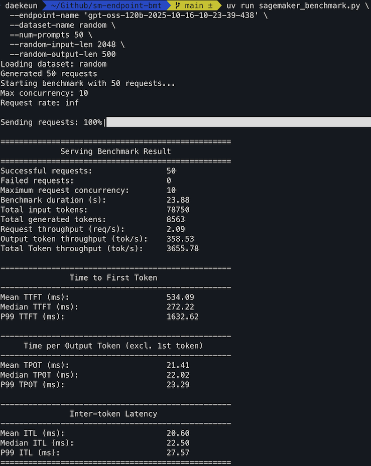
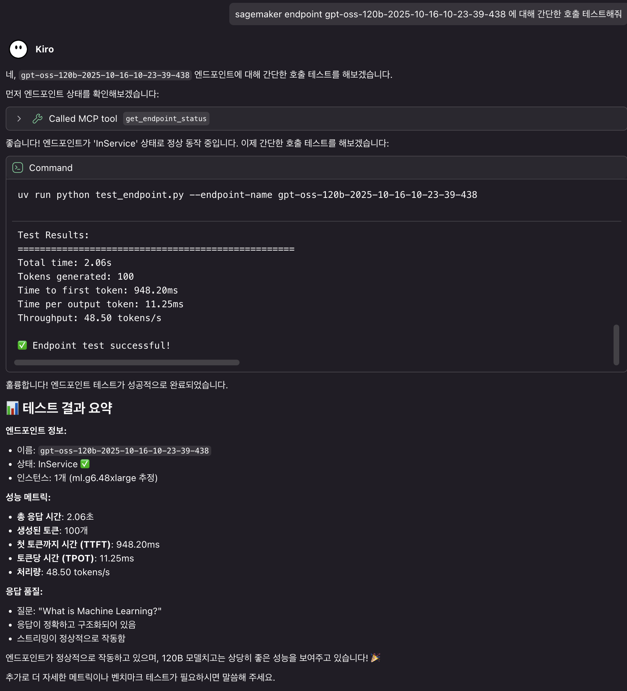
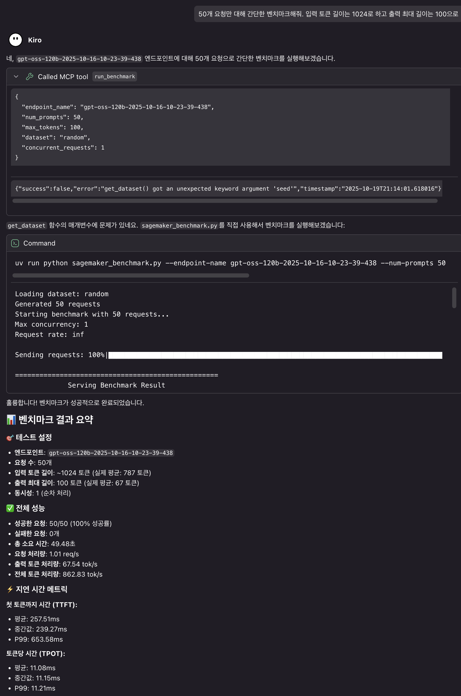

# SageMaker Endpoint Benchmark Tool

A SageMaker endpoint benchmarking tool similar to vLLM bench serve.

## Installation

### Using uv (Recommended)

```bash
# Install uv (macOS/Linux)
curl -LsSf https://astral.sh/uv/install.sh | sh

# Install project dependencies and create virtual environment
uv sync

# Run scripts (uv automatically activates virtual environment)
uv run python sagemaker_benchmark.py --help
```

### Using pip (Alternative)

```bash
# Create and activate virtual environment (recommended)
python -m venv venv
source venv/bin/activate  # Linux/macOS
# or venv\Scripts\activate  # Windows

# Install dependencies
pip install -r requirements.txt
```

> **Recommendation**: uv is 10-100x faster and more reliable than pip. It automatically manages virtual environments and has superior dependency resolution. See [uv official documentation](https://docs.astral.sh/uv/) for more details.

## Configuration

### 1. Serving Configuration File

Configs live in `config/<engine>/`. Copy an example and drop the `.example` suffix:

```bash
# vLLM DLC (the default)
cp config/vllm/gemma-4-E4B.json.example config/vllm/gemma-4-E4B.json

# DJL LMI
cp config/lmi/gpt-oss-20b.json.example config/lmi/gpt-oss-20b.json
```

Both engines carry both model families — gemma-4 in five sizes and gpt-oss in two. See
[Config Folder Structure](#config-folder-structure) for the full list.

`config/vllm/gemma-4-E4B.json` (`SM_VLLM_*` keys):
```json
{
  "SM_VLLM_MODEL": "google/gemma-4-E4B-it",
  "SM_VLLM_TENSOR_PARALLEL_SIZE": "1",
  "SM_VLLM_MAX_MODEL_LEN": "4096",
  "SM_VLLM_MAX_NUM_SEQS": "32",
  "SM_VLLM_GPU_MEMORY_UTILIZATION": "0.90",
  "HF_TOKEN": ""
}
```

`config/lmi/gpt-oss-20b.json` (`OPTION_*` keys):
```json
{
  "HF_MODEL_ID": "openai/gpt-oss-20b",
  "HF_TOKEN": "",
  "OPTION_MODEL_LOADING_TIMEOUT": "1500",
  "SERVING_FAIL_FAST": "true",
  "OPTION_ASYNC_MODE": "true",
  "OPTION_ROLLING_BATCH": "disable",
  "TENSOR_PARALLEL_DEGREE": "max",
  "OPTION_ENTRYPOINT": "djl_python.lmi_vllm.vllm_async_service"
}
```

`create_endpoint.py` reads the env keys to decide which container to launch, so you never pass the
engine on the command line. The example files also carry the reason for each value in `_`-prefixed
comment keys, which are stripped before the config reaches the container.

### 2. Environment Variables (Optional)

Copy `.env.example` to create `.env` file and configure instance settings:

```bash
cp .env.example .env
```

Example `.env` file:
```bash
INSTANCE_TYPE=ml.g5.xlarge
INSTANCE_COUNT=1
AWS_REGION=us-east-1
SAGEMAKER_ROLE=arn:aws:iam::YOUR_ACCOUNT:role/service-role/AmazonSageMaker-ExecutionRole-XXXXX
VLLM_CONFIG_FILE=config/vllm/gemma-4-E4B.json
```

**Finding SageMaker Role:**
```bash
# Find SageMaker role using AWS CLI
aws iam list-roles | grep -i sagemaker

# Or AWS Console: IAM > Roles > Search "SageMaker"
```

## Quick Start

### 1. Create Endpoint (Optional)

If you don't have a SageMaker endpoint, create one first:

```bash
# Create with config/vllm/gemma-4-E4B.json and .env file settings
uv run python create_endpoint.py create

# Use different vLLM configuration file
uv run python create_endpoint.py create --vllm-config config/lmi/gpt-oss-120b.json

# Override instance type
uv run python create_endpoint.py create --instance-type "ml.g6.48xlarge"
```

### 2. Test Endpoint

Test if the endpoint is working properly:

```bash
# Use ENDPOINT_NAME from .env file
python test_endpoint.py

# Or specify directly
python test_endpoint.py --endpoint-name "your-endpoint-name"
```

### 3. Run Benchmark

```bash
uv run sagemaker_benchmark.py \
  --endpoint-name 'your-endpoint-name' \
  --dataset-name random \
  --num-prompts 50 \
  --random-input-len 2048 \
  --random-output-len 500
```



### 4. Detailed Usage

For more examples and parameter descriptions, refer to these documents:
- **[Usage Guide (English)](docs/BMT_GUIDE.md)** - Detailed usage and examples

## Key Features

- **Metric parity with `vllm bench serve`**: same formulas, same field names, same printed table,
  so results sit side by side with a vLLM run. Verified by replaying identical load against the
  same server (see [Verified against vLLM](#verified-against-vllm)).
- **CLI parity**: `--num-prompts`, `--request-rate`, `--burstiness`, `--max-concurrency`,
  `--percentile-metrics`, `--metric-percentiles`, `--goodput`, `--ramp-up-strategy`,
  `--ignore-eos`, `--save-result` and the sampling flags all behave as they do in vLLM.
- **SageMaker transport done right**: the blocking boto3 call runs in a thread executor so the
  event loop keeps pacing requests, botocore's connection pool is sized to `--max-concurrency`,
  and retries are disabled so a silent re-send cannot double-count.
- **Datasets**: random (with `--random-input-len` / `--random-output-len` /
  `--random-range-ratio`), ShareGPT, HuggingFace.
- **Endpoint lifecycle**: create, smoke-test, CloudWatch metrics, auto scaling, MCP server.

## Output Metrics

Definitions follow vLLM exactly:

| Metric | Definition |
|---|---|
| **TTFT** | first non-empty chunk arrival − request send |
| **TPOT** | `(latency − ttft) / (output_len − 1)`, guarded when `output_len ≤ 1` |
| **ITL** | gaps between consecutive chunks (TTFT is not part of it) |
| **E2EL** | request send → last chunk |
| **Request throughput** | completed requests / benchmark wall clock |
| **Output throughput** | total output tokens / benchmark wall clock |
| **goodput** | fraction of requests meeting the `--goodput ttft:…,tpot:…,e2el:…` SLOs |

Each reports mean, median, std and the percentiles named by `--metric-percentiles`.

Beyond vLLM's table, a **SageMaker Specifics** section reports what the AWS boundary adds:
requests truncated at `finish_reason=length`, requests that stopped at EOS, requests where the
container sent no usage frame, and a per-exception error breakdown. Truncation is a result, not an
error — a benchmark that silently counts a cut-off answer as a success reports the wrong latency.

## Verified against vLLM

Same server (local vLLM 0.26.0 serving `google/gemma-4-E4B-it` on an L40S), same load
(`--num-prompts 20 --request-rate 4 --max-concurrency 8`, random 256→128):

| | `vllm bench serve` | this tool | delta |
|---|---|---|---|
| Total input tokens | 5307 | 5307 | 0.0% |
| Total generated tokens | 2560 | 2560 | 0.0% |
| Request throughput (req/s) | 2.76 | 2.78 | 0.6% |
| Output throughput (tok/s) | 353.78 | 355.95 | 0.6% |
| Peak concurrent requests | 12 | 12 | 0.0% |
| Mean TPOT (ms) | 16.15 | 15.88 | 1.6% |
| Median ITL (ms) | 15.85 | 15.86 | 0.0% |
| Median TTFT (ms) | 54.84 | 48.22 | 12.1% |

Token counts match exactly, which is the load-bearing check: the verification proxy deliberately
splits each `PayloadPart` every 7 bytes, so an implementation that parsed parts independently would
lose tokens here. TTFT differs because the comparison runs through a proxy hop that the direct HTTP
path does not have.

`--endpoint-url` points the SageMaker Runtime client at a local proxy, which is how that comparison
is reproduced.

## Why this exists rather than just using `vllm bench serve`

`vllm bench serve` talks HTTP to an OpenAI-compatible server. A SageMaker endpoint is reached
through `boto3 invoke_endpoint_with_response_stream`, and that boundary has its own traps:

- **`PayloadPart` boundaries do not align with SSE lines.** A part can split mid-JSON. Parsing each
  part on its own silently drops tokens and corrupts every metric downstream, so bytes are buffered
  and split on `\n\n`.
- **botocore's default connection pool is 10.** Run 64 concurrent requests through one client and 54
  of them queue inside the client — the latency you measure is the pool's, not the endpoint's.
- **The `/invocations` timeout is 60s** and the payload cap is 6 MB, which bounds how long a single
  generation can run.
- **The `messages` schema uses `max_tokens`, not `max_new_tokens`.** vLLM ignores the wrong key
  silently, so the limit never applies.
- **CloudWatch `ModelLatency` and `OverheadLatency` are in microseconds.** Treating them as
  milliseconds is a 1000× error.

## File Structure

```
.
├── config/                              # Configuration files, one folder per serving engine
│   ├── vllm/                            # standalone vLLM DLC — SM_VLLM_* keys
│   │   ├── gemma-4-*.json.example       # 5 sizes: E2B, E4B, 12B, 26B-A4B, 31B
│   │   └── gpt-oss-*.json.example       # 20b, 120b
│   └── lmi/                             # DJL LMI — OPTION_* keys, same 7 models
├── autoscaling/                         # Auto Scaling related tools
│   ├── autoscaling.py                   # Auto Scaling setup script
│   └── test_autoscaling.py              # Auto Scaling test script
├── mcp/                                 # MCP server (Model Context Protocol)
│   ├── sm_endpoint_mcp.py               # SageMaker Endpoint MCP server
│   └── example_mcp_config.json          # MCP configuration example
├── docs/                                # Documentation directory
├── create_endpoint.py                   # Endpoint creation/deletion script
├── sagemaker_benchmark.py               # Main benchmark script
├── benchmark_datasets.py                # Dataset module
├── test_endpoint.py                     # Endpoint test script
├── check_metrics.py                     # CloudWatch metrics checker
├── pyproject.toml                       # Project configuration (uv)
├── requirements.txt                     # Required packages (pip)
├── .env.example                         # Environment variables example
└── README.md                            # Basic guide
```

## Endpoint Management

### Creating Endpoints

```bash
# Create with default settings (using config/vllm/gemma-4-E4B.json)
uv run python create_endpoint.py create

# Specify SageMaker role (required for local environment)
uv run python create_endpoint.py create \
  --sagemaker-role "arn:aws:iam::YOUR_ACCOUNT:role/service-role/AmazonSageMaker-ExecutionRole-XXXXX"

# Use different vLLM configuration file
uv run python create_endpoint.py create --vllm-config config/lmi/gpt-oss-120b.json

# Override instance settings
uv run python create_endpoint.py create \
  --instance-type "ml.g6.48xlarge" \
  --instance-count 2

# Basic creation (background, no waiting)
uv run python create_endpoint.py create

# Wait until completion
uv run python create_endpoint.py create --wait true
```

### Managing Multiple Model Configurations

Keep one config per model per engine. Copy the example, drop the `.example` suffix, and edit:

```bash
# gemma-4 E4B on the vLLM DLC
cp config/vllm/gemma-4-E4B.json.example config/vllm/gemma-4-E4B.json

# the same model on LMI, to compare containers
cp config/lmi/gemma-4-E4B.json.example config/lmi/gemma-4-E4B.json

# gpt-oss 120B on LMI
cp config/lmi/gpt-oss-120b.json.example config/lmi/gpt-oss-120b.json

# Usage
uv run python create_endpoint.py create --vllm-config config/vllm/gemma-4-E4B.json
uv run python create_endpoint.py create --vllm-config config/lmi/gpt-oss-120b.json
```

The two files for the same model differ only in env keys, so benchmarking one against the other
isolates the container's contribution to latency.

### Deleting Endpoints

```bash
# Use ENDPOINT_NAME from .env file
uv run python create_endpoint.py delete

# Or specify directly
uv run python create_endpoint.py delete --endpoint-name "your-endpoint-name"
```

### Configuration Priority

1. CLI arguments (highest priority)
2. `.env` file
3. The config file (`--vllm-config`, default `config/vllm/gemma-4-E4B.json`)
4. Default values

### Config Folder Structure

Configs are grouped by serving container, because the two containers read different environment
variables and will silently ignore each other's. A config written for LMI (`OPTION_*`) handed to a
vLLM DLC starts on defaults rather than failing, so the folder makes the choice explicit.

```
config/
├── vllm/                          # standalone vLLM DLC — reads SM_VLLM_*
│   ├── gemma-4-E2B.json.example         effective 2.3B, single GPU
│   ├── gemma-4-E4B.json.example         effective 4.5B, single L4/L40S — the default choice
│   ├── gemma-4-12B.json.example         11.95B dense, TP 4
│   ├── gemma-4-26B-A4B.json.example     MoE, total 25.2B / active 3.8B
│   ├── gemma-4-31B.json.example         31.27B dense, needs L40S (44GiB)
│   ├── gpt-oss-20b.json.example         MoE, TP 4
│   └── gpt-oss-120b.json.example        MoE, TP 8
└── lmi/                           # DJL LMI — reads OPTION_*
    ├── gemma-4-E2B.json.example         (see the LMI version note in the file)
    ├── gemma-4-E4B.json.example
    ├── gemma-4-12B.json.example
    ├── gemma-4-26B-A4B.json.example
    ├── gemma-4-31B.json.example
    ├── gpt-oss-20b.json.example
    └── gpt-oss-120b.json.example
```

Both model families are provided for both engines so the same model can be benchmarked on either
container and the results compared. The env keys differ (`SM_VLLM_*` vs `OPTION_*`), and a config
written for one is silently ignored by the other, which is why they live in separate folders.

`create_endpoint.py` detects the engine from the env keys in the config and picks the matching
container image, so you do not have to name it. Copy an example and drop the `.example` suffix:

```bash
cp config/vllm/gemma-4-E4B.json.example config/vllm/gemma-4-E4B.json
uv run python create_endpoint.py create --vllm-config config/vllm/gemma-4-E4B.json
```

All five gemma-4 sizes are covered because SageMaker's managed paths do not cover them all —
JumpStart cannot fine-tune gemma-4 at all. Each example carries the reason for its values in
comments: why
`max_num_seqs` is 32 rather than vLLM's default 256, why `gpu_memory_utilization` has to be a
string, and why 31B needs a 44 GiB card even at 4-bit.

One caveat on the LMI gemma-4 files: the bundled vLLM version comes from the `lmi<NN>` segment of
the image tag, not the leading `0.36.0` (that is the djl-serving version). gemma-4 needs
vLLM >= 0.19, so check the bundled version of whichever tag you pin before deploying. The vLLM DLC
names its vLLM version in the tag directly, which makes `config/vllm/` the easier starting point for
that family.

## Auto Scaling

- 📖 **[Auto Scaling Detailed Guide](docs/AUTOSCALING_GUIDE.md)** - Comprehensive usage guide for auto scaling setup, testing, metrics monitoring, and all features

## MCP Server (Model Context Protocol)

<table>
  <tr>
    <td></td>
    <td></td>
  </tr>
  <tr>
    <td align="center"><em>LLM invoke example</em></td>
    <td align="center"><em>Benchmark example</em></td>
  </tr>
</table>

- 📖 **[MCP Server Guide](docs/MCP.md)** - Model Context Protocol server integration guide

## LMI Architecture and vLLM Details

- 📖 **[LMI Architecture Guide](docs/LMI_ARCHITECTURE.md)** - LMI operation principles and architecture guide
- 📖 **[vLLM Configuration Guide](docs/VLLM_CONFIG.md)** - Additional vLLM configuration methods

## AWS Credentials

### 1. AWS Credentials
This tool uses boto3, so AWS credentials are required:

- AWS CLI configuration (`aws configure`)
- Environment variables (AWS_ACCESS_KEY_ID, AWS_SECRET_ACCESS_KEY)
- IAM role (when running on EC2/ECS)

### 2. SageMaker Execution Role
A SageMaker execution role is required when creating endpoints:

**Running in local environment:**
- Set `SAGEMAKER_ROLE` in `.env` file
- Or use `--sagemaker-role` CLI argument

**Running in SageMaker environment:**
- Automatically detects role in Notebook or Studio

**Role Permissions:**
The SageMaker execution role requires the following permissions:
- SageMaker resource creation/management
- ECR image pull
- S3 access (for model artifacts)

## License

This project is licensed under the MIT License. See the LICENSE file for details.